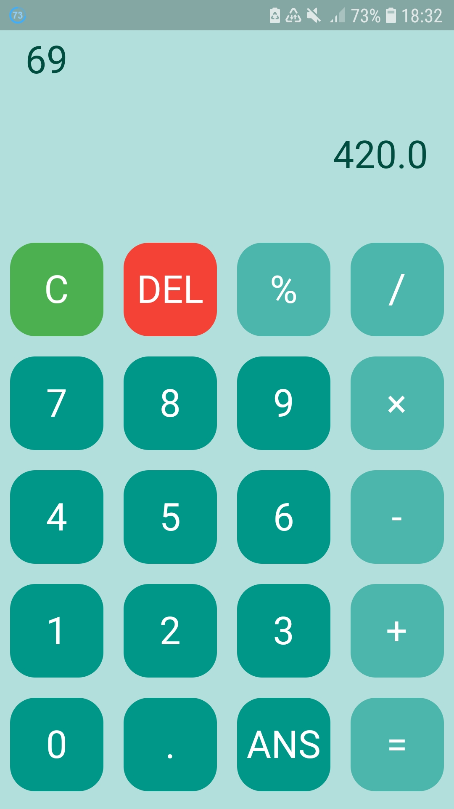

# calculator

A small and simple Flutter calculator, created to practice Flutter. Link to the app: https://play.google.com/store/apps/details?id=com.banik1103.calculator2

## Getting Started

In order to run this, make sure that you have Flutter installed. Download the files, and run main.dart, it is located in the lib folder.

## Picture of the app:

